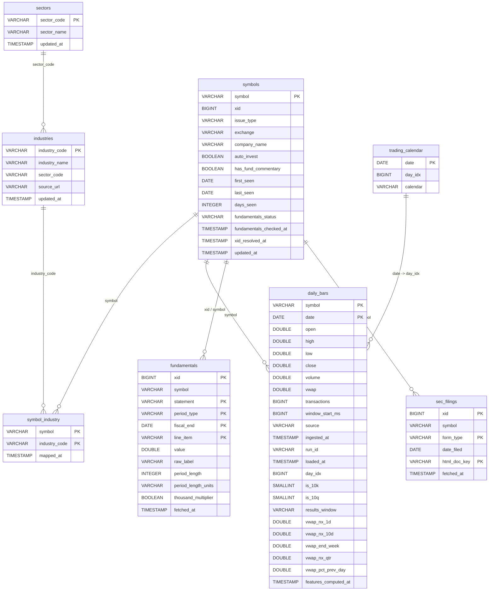
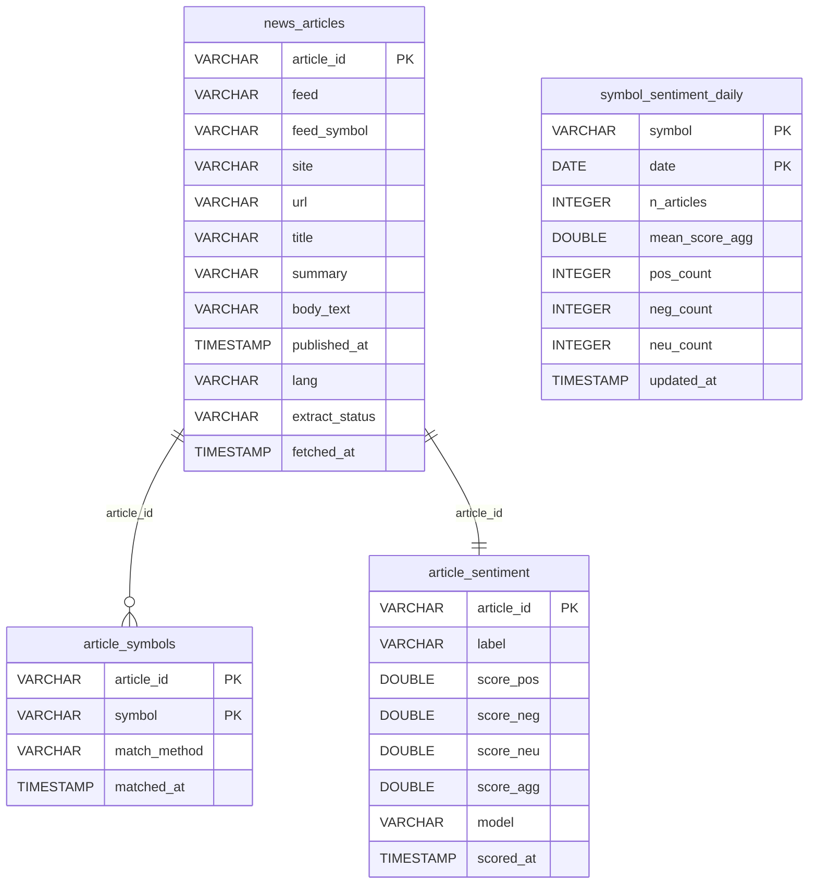

# Database schema

<!-- GENERATED FILE — do not edit by hand.
     Regenerate with: uv run python scripts/gen_schema_docs.py
     Source of truth: each store's `_DDL` in the module noted per section. -->

MTap keeps two independent [DuckDB](https://duckdb.org) stores. Both are created and migrated idempotently on open (`CREATE TABLE IF NOT EXISTS` + additive `ALTER`), so the diagrams below reflect a freshly-opened DB. Foreign keys are logical only (DuckDB stores them as comments); the edges are drawn from the relationships in the generator.

## E*TRADE fundamentals store

The concise, normalized system-of-record for the E*TRADE collector. `symbols` is the canonical ticker universe; the price series, fundamentals, filings, and TRBC sector/industry dimensions hang off it.

- **Default path:** `state/etrade/fundamentals.duckdb`
- **DDL source:** [`python/sourcing_py/etrade/db.py`](../python/sourcing_py/etrade/db.py)

## News processing store

Independent store for the news layer. It never owns symbols: `article_symbols.symbol` and `symbol_sentiment_daily.symbol` reference the E*TRADE `symbols` table, read READ-ONLY via `load_symbol_universe()` (see the cross-store note below).

- **Default path:** `state/news/news.duckdb`
- **DDL source:** [`python/sourcing_py/news/db.py`](../python/sourcing_py/news/db.py)

## Cross-store reference

The news store's `article_symbols.symbol` and `symbol_sentiment_daily.symbol` columns point at `symbols.symbol` in the **E*TRADE fundamentals store**. There is no database foreign key across the two files; the news layer opens the E*TRADE DB read-only to load the symbol universe (`news/db.py::load_symbol_universe`).
