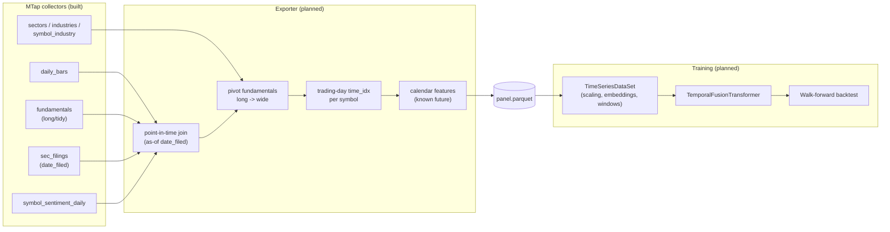

# Stock prediction plan (MTap → TFT)

This is a design/planning doc, hand-maintained — unlike
[database-schema.md](database-schema.md), which is generated from the DDL. Update this
file when the plan changes; it does not need to track code line-for-line.

## 1. Goal

MTap's `etrade` and `news` collectors exist to build one thing: a clean, point-in-time
**panel dataset** (one row per `symbol × trading-day`) that a **Temporal Fusion
Transformer (TFT)** trains on to forecast per-symbol price behavior. MTap itself does not
train models — it is the *sourcing and feature-store* layer. Training happens downstream,
reading a Parquet export produced from the DuckDB stores.

Everything currently built (collectors, DuckDB schema, sector/industry mapping, news
sentiment) is Phase 1 of this plan: **get the raw, normalized facts into DuckDB.** Nothing
that turns those facts into a training-ready tensor exists yet — that's Phase 2, described
in §5–§7 below.

## 2. What's already built (Phase 1 — sourcing)

| Store | Status | Feeds |
|---|---|---|
| `etrade` fundamentals DB (`state/etrade/fundamentals.duckdb`) | **Done** | Master symbol table, EOD OHLCV (`daily_bars`), quarterly/annual fundamentals (`fundamentals`), SEC filings (`sec_filings`), TRBC sector/industry (`sectors`/`industries`/`symbol_industry`) |
| `news` sentiment DB (`state/news/news.duckdb`) | **Done** (segment 3 deferred) | RSS aggregation (`news_articles`), FinBERT scoring + verified symbol attribution (`article_sentiment`/`article_symbols`), daily rollup (`symbol_sentiment_daily`, run on-demand) |

Reference scale from real runs: 15,886 symbols; 5.7M EOD bars; 6,801 symbols with
fundamentals (~5.48M rows) + 9,014 correctly identified as no-data (ETF/fund/delisted, not
failures); 5,808 symbols sector/industry-classified via MBin's TRBC data.

Full schema + ER diagrams: [database-schema.md](database-schema.md).

### 2b. Derived feature columns (derive-features — done)

`sourcing-py etrade derive-features` (module `etrade/features.py`) computes calendar-aligned,
point-in-time features and materializes them onto `daily_bars`. It is a **full, idempotent
recompute** — every derived column is reset and rewritten each run — so it must be re-run
after each `ingest-eod` (the forward-looking columns for existing rows change as new bars
land). All work is set-based SQL in one transaction.

- **`day_idx`** — a **global** trading-day index shared across symbols (contiguous integers,
  `day_idx = 1` at the first NYSE session on/after 2020-01-01). It comes from a new
  `trading_calendar(date, day_idx, calendar)` dimension table, itself built from the generic
  `sourcing_py/utils/trading_calendar.py` helper (wraps `exchange_calendars`' authoritative
  `XNYS` calendar; weekends and market holidays are excluded because they are not sessions).
  This is the source of truth for the trading-day step and is reusable by the exporter and
  the news layer. It **coexists with** the per-symbol `time_idx` of §5.1: `day_idx` gives
  cross-symbol calendar alignment (feed TFT directly with `allow_missing_timesteps=True`),
  while a per-symbol `time_idx` can still be derived at export.
- **`is_10k` / `is_10q`** — 1 on the trading day a 10-K/10-Q was filed (the announcement day,
  t=0); a filing landing on a weekend/holiday snaps forward to the next session. This is the
  materialized announcement-date signal that §5.2's as-of join relies on.
- **`results_window`** — earnings-window classification relative to the **nearest** filing t
  (offsets in trading days): `Pre_Earnings_Runup` (t−10..t−2), `Earnings_Eve` (t−1),
  `Earnings_Day` (t=0), `Post_Earnings_Reaction` (t+1..t+3), `Post_Earnings_Drift` (t+4..t+15),
  else `Normal_Trading`. Ties in |offset| resolve toward the upcoming filing.
- **Forward VWAP aggregates** (volume-weighted `SUM(vwap*volume)/SUM(volume)`): `vwap_nx_1d`
  (next trading day), `vwap_nx_10d` (next 10 trading days), `vwap_end_week` (current day
  through the last session of the current ISO week), `vwap_nx_qtr` (current day through the
  next 10-K/10-Q filing day). NULL where the forward window is empty.
- **`vwap_pct_prev_day`** — backward-looking vwap % change vs the previous trading day
  (`(vwap − prev_vwap)/prev_vwap`, a fraction; NULL on a symbol's first bar). A ready-made
  short-horizon return feature for the panel.

## 3. What's not built yet (Phase 2 — the ML export)

Nothing below exists in code yet. This section is the plan for it.

- A DuckDB→Parquet **exporter** (`sourcing-py etrade export-tft` or similar) that performs
  the point-in-time join + pivot + `time_idx` assembly described in §5, and writes
  `panel.parquet`.
- A small **TFT dataset config module** wrapping `pytorch-forecasting`'s
  `TimeSeriesDataSet`, classifying panel columns into TFT's variable roles (§6).
- Training / backtesting scripts (§7).
- `pytorch-forecasting` (and its pinned `pytorch-lightning`) are **not yet a dependency** —
  only `torch` is (for FinBERT). Needs a compatibility check against the existing
  `torch>=2.2` pin before adding.

## 4. Pipeline overview

Rule of thumb for where a transform belongs: **DuckDB does joins/reshape/point-in-time;
TFT does scaling/encoding/windowing.** Don't duplicate what `TimeSeriesDataSet` already
does well — see §6.

## 5. Panel assembly (DuckDB side)

The exporter's job is to produce one **long-format** table: one row per
`(symbol, trading_day)`, wide on features. Concretely:

1. **Trading-day `time_idx` per symbol** — `row_number() OVER (PARTITION BY symbol ORDER
   BY date)` on `daily_bars`. TFT needs a contiguous integer step index; calendar dates
   have weekend/holiday gaps that would otherwise look like missing timesteps. Note a
   **global** `daily_bars.day_idx` already exists (derive-features, §2b) — a single NYSE-session
   index shared across symbols. Prefer it for cross-symbol alignment; derive a per-symbol
   `time_idx` here only if a symbol-local index is needed.

2. **Point-in-time fundamentals join — the most important correctness rule.**
   `fundamentals.fiscal_end` is a reporting *period end*, not the date the numbers became
   public. Joining on `fiscal_end` directly leaks the future into the past (the model
   would "know" Q2 numbers before the 10-Q was filed). Join each quarter's fundamentals as
   of `sec_filings.date_filed` for that period instead, then forward-fill the last-known
   quarterly values onto every daily row until the next filing. (Fallback for symbols
   without a matching filing row: `fiscal_end + fixed lag`, e.g. 45 days — approximate,
   used only when `sec_filings` has no row for a period.)

3. **Pivot `fundamentals` long→wide, curated.** The table is keyed by `line_item`
   (`ATCA`, `RTLR`, …) — hundreds of sparse stable-codes. Don't pivot all of them; pick a
   curated set (~15–30 line items that are populated broadly and plausibly predictive),
   pivot to columns, and **apply `thousand_multiplier` to `value` first**.

4. **Collapse `symbol_industry` to one row per symbol.** The schema allows many
   industries per symbol (many-to-many), but a TFT *static categorical* needs exactly one
   value per series. Pick a primary industry (first/most-recent membership) or roll up to
   `sector_code` only.

5. **Join `symbol_sentiment_daily` on `(symbol, date)`**, filling missing days with a
   neutral/zero sentiment (most symbol-days will have no news).

6. **Calendar features** (day-of-week, month, quarter-end flag, days-to-next-known-filing)
   — these belong in `time_varying_known_reals` since they're knowable in advance, unlike
   price/fundamentals/sentiment.

## 6. TFT variable classification

Once the panel Parquet exists, `pytorch-forecasting`'s `TimeSeriesDataSet` is built from
it by classifying columns into roles:

| TFT role | Panel columns |
|---|---|
| `group_ids` | `symbol` |
| `time_idx` | trading-day index (§5.1) |
| `static_categoricals` | `exchange`, `issue_type`, `sector_code`, primary `industry_code` |
| `time_varying_known_reals` | `time_idx`, calendar features |
| `time_varying_unknown_reals` | `open/high/low/close/volume/vwap`, pivoted fundamentals, `mean_score_agg`/`n_articles` |
| `target` | `close` (candidate alternative: log-return — an open decision, §8) |

Deliberately **left to `TimeSeriesDataSet` / TFT**, not pre-computed in DuckDB:

- **Per-series scaling** — `GroupNormalizer(groups=["symbol"], transformation="log")`.
  Matters because a $5 stock and a $500 stock share one model; per-series normalization
  (not global) is the point.
- **Categorical embeddings** for `exchange`/`sector_code`/etc. — automatic.
- **Lags / relative time index** — `add_relative_time_idx=True`, `lags={...}`.
- **Missing-timestep handling** — `allow_missing_timesteps=True` (some symbols have
  sparser history than others).

Pre-scaling or one-hot-encoding these in DuckDB would double-normalize or throw away the
per-series scaling TFT depends on — so the exporter should emit **raw joined values**, not
normalized ones.

## 7. Training & evaluation plan

Not yet built. Planned shape:

- **Split:** walk-forward / expanding-window backtest (train on an earlier block, validate
  on the following block, roll forward), not a random shuffle split — this is a time
  series, so random splits leak future information into training.
- **Encoder/decoder lengths:** e.g. 60 trading days of history → 5–20 day forecast horizon
  (exact values TBD once data density per symbol is characterized).
- **Metrics:** quantile loss (TFT's native loss) plus a directional-accuracy check
  (did it get the sign of the move right) since point-price MAE is a weak proxy for
  trading usefulness.
- **Universe filtering:** likely restrict training to symbols with enough history
  (`days_seen` above a threshold) and `fundamentals_status='ok'` — ETFs/funds have no
  fundamentals signal and may need a separate, price-only model.

## 8. Open decisions

These need a call before the exporter is built — flagging them rather than guessing:

1. **Target: normalized price vs. log-return.** Price is simpler (TFT handles the scaling
   via `GroupNormalizer(transformation="log")`), log-return is more stationary across
   symbols and standard for financial forecasting but less directly interpretable. Leaning
   toward starting with normalized close and revisiting if forecasts look non-stationary.
2. **Point-in-time join strategy default.** `sec_filings.date_filed` (correct, needs
   filings present) vs. a fixed lag from `fiscal_end` (simpler, works everywhere, coarser).
   Likely: date_filed where available, lag as fallback (see §5.2).
3. **Which fundamentals line items to curate** for the wide pivot — needs a look at
   `line_item` value coverage across the fetched universe before picking ~15–30.
4. **ETF/fund/no-fundamentals symbols** — separate price+sentiment-only model, or excluded
   entirely from Phase 2 training.

## 9. Roadmap

- [x] Phase 1 — sourcing: symbols, EOD bars, fundamentals, filings, sector/industry, news
- [x] Derived feature columns on `daily_bars` (`derive-features`): global `day_idx` +
  `trading_calendar`, 10-K/10-Q filing flags, `results_window`, forward VWAPs (§2b)
      sentiment, all in DuckDB (done, see §2).
- [x] Phase 2a — exporter: `sourcing-py etrade export-tft` → `out/tft/panel.parquet` + `panel.meta.json`
  (price/calendar/sentiment/filing-flag features; fundamentals pivot not yet included).
- [ ] Phase 2b — `TimeSeriesDataSet` config module (variable classification from §6).
- [ ] Phase 2c — training script + walk-forward backtest harness (§7).
- [ ] Phase 2d — resolve open decisions in §8 as data characterization lands.
